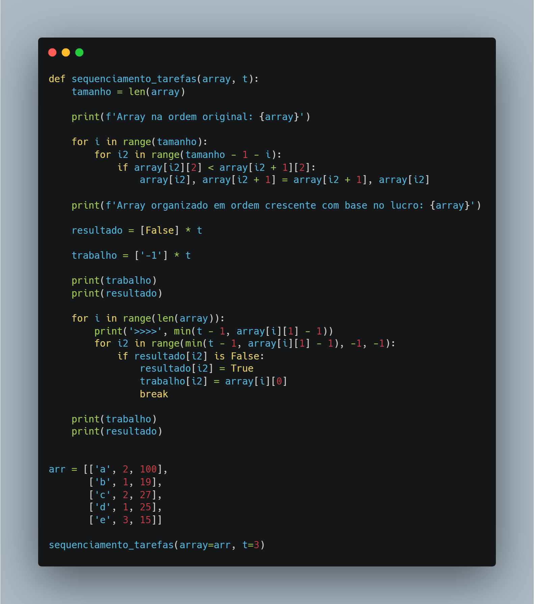
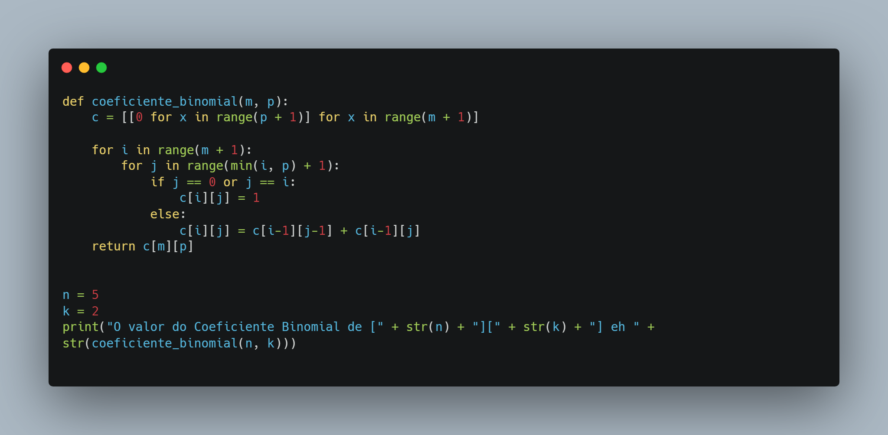
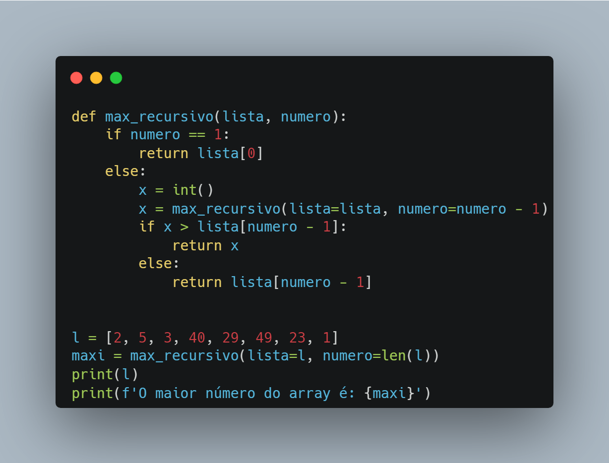
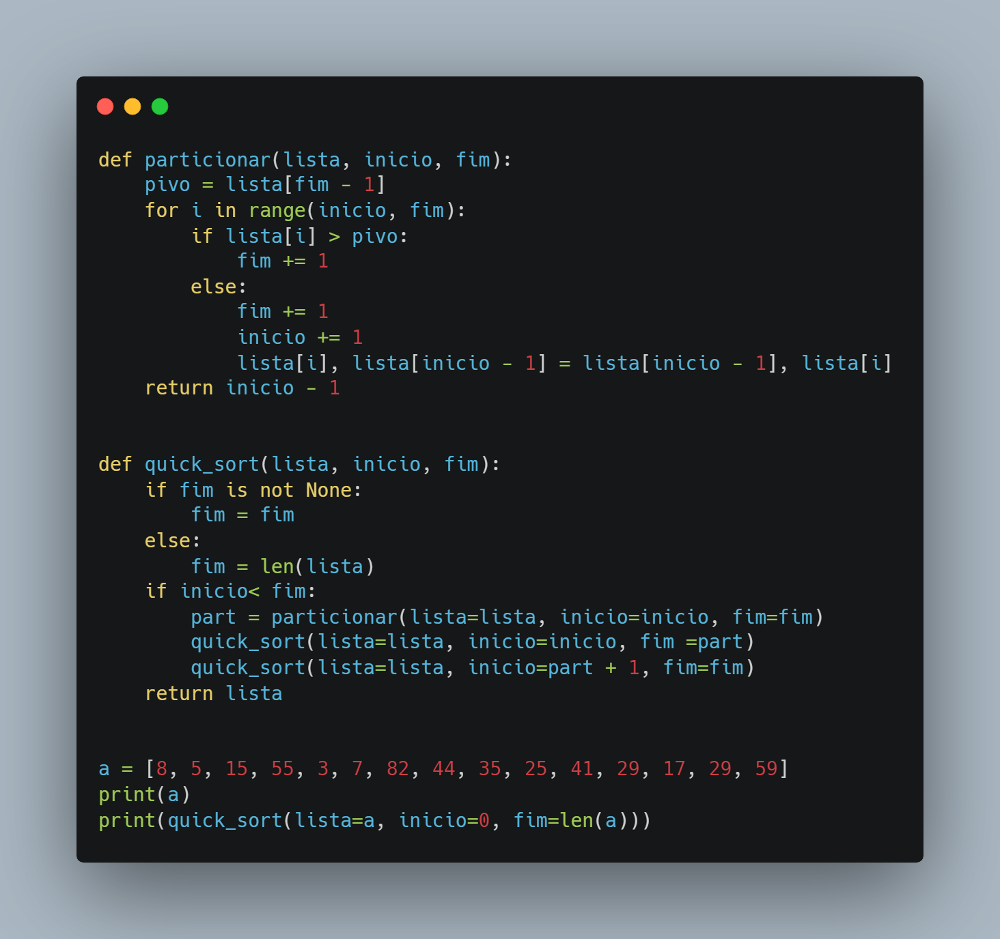
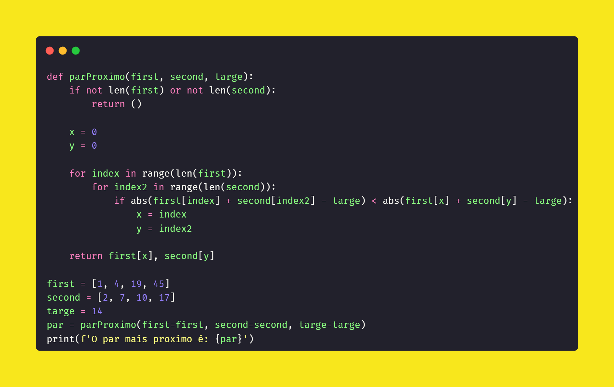

# Trabalho de Tecnicas e Analise de Algoritmos
## Algoritmos Gulosos
**Problema de Sequenciamento de Tarefas**
 
 

## Programação Dinamica
**Subset Sum**
 
 

## Recursividade
**Maximo Recursivo**
 
 

## Divisão e Conquista
**Quick Sort**
 
 

## Força Bruta
**Par Proximo**
 
 

